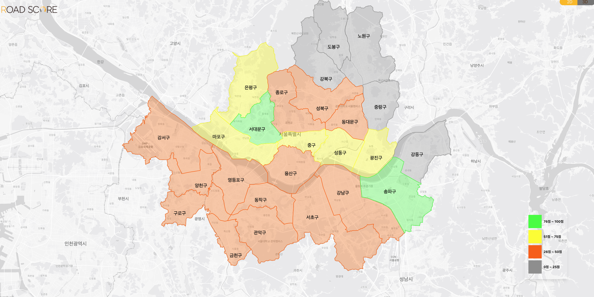
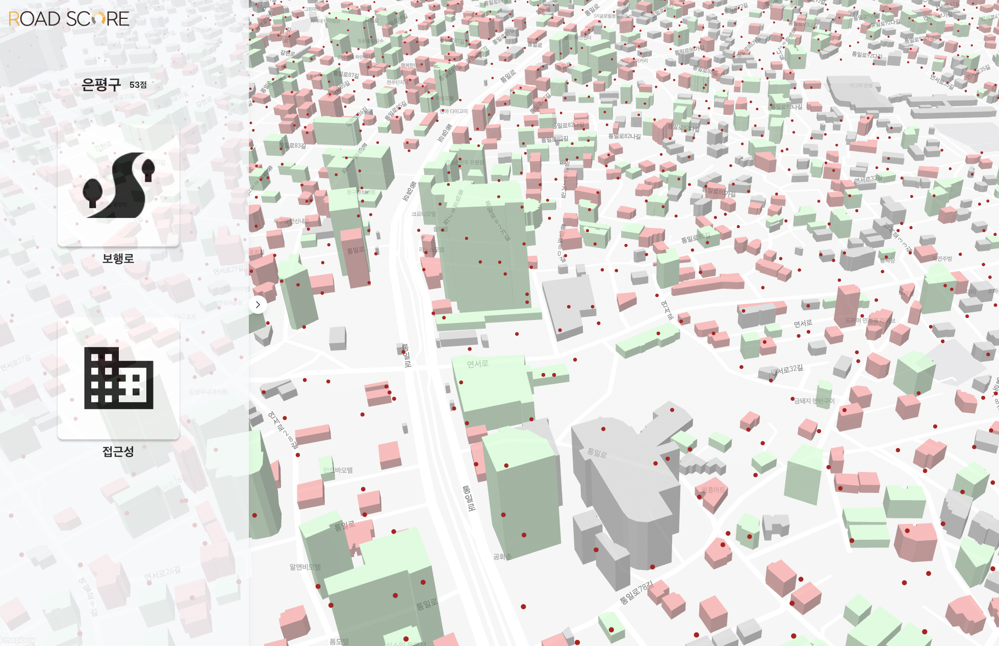
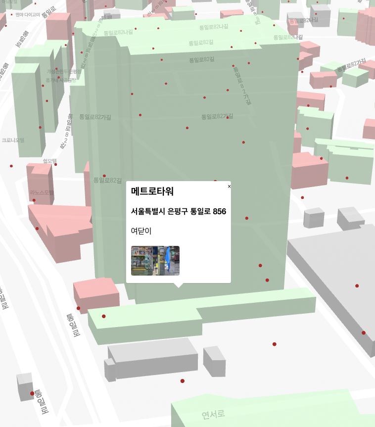

# Road-Score

A Road-Score , written in Node.js(20lts). 

[](https://deploy.cloud.run)

##

Docker Local Test시 GCP keyfile.json, docker-compose.yml이 필요하다.

1. key를 GCP 다운로드(IAM 및 관리자 - 서비스 계정에서 관리)하여 로컬 프로젝트 루트 디렉토리에 keyfile.json으로 파일명을 변경하여 저장한다.

2. docker-compose.yml을 로컬 프로젝트 루트 디렉토리에 저장한다.(비밀 키들이 저장되어있으므로 절대 인터넷 환경에 업로드하지 않는다.)

3. docker compose로 빌드
    ```bash
    docker-compose up
    ```
4. api 요청시 api key 관리
    무작위 base64 생성 in postgreSQL
    ```bash
    CREATE EXTENSION IF NOT EXISTS pgcrypto;
    SELECT encode(gen_random_bytes(32), 'base64');
    ```
    production은 Secret Manager의 TEST_API_KEYS로 관리,
    development는 docker-compose.yml의 environments TEST_API_KEYS로 관리한다.(json을 직접 load하지 못하여 트릭으로 적용. 값마다 \ 값이 들어가므로 주의)
    Secret Manager key 업데이트 후 해당 Cloud Run 서버에서 새 버전 수정 및 배포 후 배포버튼을 눌러야 적용됨.

## Prerequisite

* Enable the Cloud Run API via the [console](https://console.cloud.google.com/apis/library/run.googleapis.com?_ga=2.124941642.1555267850.1615248624-203055525.1615245957) or CLI:<IMAGE ID>

```bash
gcloud services enable run.googleapis.com
```

## Features

* **Express**: Web server framework
* **Buildpack support** Tooling to build production-ready container images from source code and without a Dockerfile
* **Dockerfile**: Container build instructions, if needed to replace buildpack for custom build
* **SIGTERM handler**: Catch termination signal for cleanup before Cloud Run stops the container
* **Service metadata**: Access service metadata, project Id and region, at runtime
* **Local development utilities**: Auto-restart with changes and prettify logs
* **Structured logging w/ Log Correlation** JSON formatted logger, parsable by Cloud Logging, with [automatic correlation of container logs to a request log](https://cloud.google.com/run/docs/logging#correlate-logs).
* **Unit and System tests** Basic unit and system tests setup for the microservice

## Local Development

### Cloud Code

This template works with [Cloud Code](https://cloud.google.com/code), an IDE extension
to let you rapidly iterate, debug, and run code on Kubernetes and Cloud Run.

Learn how to use Cloud Code for:

* Local development - [VSCode](https://cloud.google.com/code/docs/vscode/developing-a-cloud-run-service), [IntelliJ](https://cloud.google.com/code/docs/intellij/developing-a-cloud-run-service)

* Local debugging - [VSCode](https://cloud.google.com/code/docs/vscode/debugging-a-cloud-run-service), [IntelliJ](https://cloud.google.com/code/docs/intellij/debugging-a-cloud-run-service)

* Deploying a Cloud Run service - [VSCode](https://cloud.google.com/code/docs/vscode/deploying-a-cloud-run-service), [IntelliJ](https://cloud.google.com/code/docs/intellij/deploying-a-cloud-run-service)
* Creating a new application from a custom template (`.template/templates.json` allows for use as an app template) - [VSCode](https://cloud.google.com/code/docs/vscode/create-app-from-custom-template), [IntelliJ](https://cloud.google.com/code/docs/intellij/create-app-from-custom-template)

### CLI tooling

#### Local development

1. Set Project Id:
    ```bash
    export GOOGLE_CLOUD_PROJECT=<GCP_PROJECT_ID>
    ```
2. Start the server with hot reload:
    ```bash
    npm run dev
    ```

#### Deploying a Cloud Run service

1. Set Project Id:
    ```bash
    export GOOGLE_CLOUD_PROJECT=<GCP_PROJECT_ID>
    ```

1. Enable the Artifact Registry API:
    ```bash
    gcloud services enable artifactregistry.googleapis.com
    ```

1. Create an Artifact Registry repo:
    ```bash
    export REPOSITORY="samples"
    export REGION=us-central1
    gcloud artifacts repositories create $REPOSITORY --location $REGION --repository-format "docker"
    ```
  
1. Use the gcloud credential helper to authorize Docker to push to your Artifact Registry:
    ```bash
    gcloud auth configure-docker
    ```

2. Build the container using a buildpack:
    ```bash
    npm run build
    ```
    
3. Deploy to Cloud Run:
    ```bash
    npm run deploy
    ```

### Run sample tests

1. [Pass credentials via `GOOGLE_APPLICATION_CREDENTIALS` env var](https://cloud.google.com/docs/authentication/production#passing_variable):
    ```bash
    export GOOGLE_APPLICATION_CREDENTIALS="[PATH]"
    ```

2. Set Project Id:
    ```bash
    export GOOGLE_CLOUD_PROJECT=<GCP_PROJECT_ID>
    ```
3. Run unit tests
    ```bash
    npm run test
    ```

4. Run system tests
    ```bash
    gcloud builds submit \
        --config test/advance.cloudbuild.yaml \
        --substitutions 'COMMIT_SHA=manual'
    ```
    The Cloud Build configuration file will build and deploy the containerized service
    to Cloud Run, run tests managed by NPM, then clean up testing resources. This configuration restricts public
    access to the test service. Therefore, service accounts need to have the permission to issue Id tokens for request authorization:
    * Enable Cloud Run, Cloud Build, Artifact Registry, and IAM APIs:
        ```bash
        gcloud services enable run.googleapis.com cloudbuild.googleapis.com iamcredentials.googleapis.com artifactregistry.googleapis.com
        ```

    * Set environment variables.
        ```bash
        export PROJECT_ID="$(gcloud config get-value project)"
        export PROJECT_NUMBER="$(gcloud projects describe $(gcloud config get-value project) --format='value(projectNumber)')"
        ```

    * Create an Artifact Registry repo (or use another already created repo):
        ```bash
        export REPOSITORY="samples"
        export REGION=us-central1
        gcloud artifacts repositories create $REPOSITORY --location $REGION --repository-format "docker"
        ```
  
    * Create service account `token-creator` with `Service Account Token Creator` and `Cloud Run Invoker` roles.
        ```bash
        gcloud iam service-accounts create token-creator

        gcloud projects add-iam-policy-binding $PROJECT_ID \
            --member="serviceAccount:token-creator@$PROJECT_ID.iam.gserviceaccount.com" \
            --role="roles/iam.serviceAccountTokenCreator"
        gcloud projects add-iam-policy-binding $PROJECT_ID \
            --member="serviceAccount:token-creator@$PROJECT_ID.iam.gserviceaccount.com" \
            --role="roles/run.invoker"
        ```

    * Add `Service Account Token Creator` role to the Cloud Build service account.
        ```bash
        gcloud projects add-iam-policy-binding $PROJECT_ID \
            --member="serviceAccount:$PROJECT_NUMBER@cloudbuild.gserviceaccount.com" \
            --role="roles/iam.serviceAccountTokenCreator"
        ```

## Maintenance & Support

This repo performs basic periodic testing for maintenance. Please use the issue tracker for bug reports, features requests and submitting pull requests.

## Contributions

Please see the [contributing guidelines](CONTRIBUTING.md)

## License

This library is licensed under Apache 2.0. Full license text is available in [LICENSE](LICENSE).

# Door-Scanner API Server

A Door-Scanner API Server, written in Node.js(20lts). 

[](https://deploy.cloud.run)

---

## Screenshots

### 1. 메인 화면


Road-Score 메인 화면으로, 각 지역에 보행로 알고리즘으로 산출된 점수를 부여한 화면이 노출됩니다.

---

### 2. 건물 화면


수집한 건물들의 빌딩 폴리곤을 보여줍니다. 해당건물들은 접근성 점수를 부여받고 점수에 따른 색상을 가지게됩니다.

---

### 3. 건물 상세 정보


선택한 건물의 상세 정보를 보여줍니다. 출입구 정보, 사진등 , 주소등 해당 건물의 데이터를 노출합니다.

---

## Prerequisite

* Enable the Cloud Run API via the [console](https://console.cloud.google.com/apis/library/run.googleapis.com?_ga=2.124941642.1555267850.1615248624-203055525.1615245957) or CLI:<IMAGE ID>

```bash
gcloud services enable run.googleapis.com